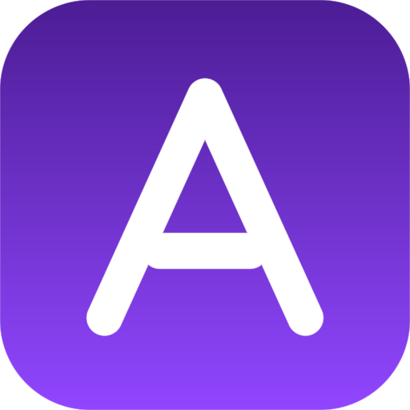

<div align="center">



# Anomalist

**Self-hosted, open-source stream overlay control for OBS**

[Documentation](https://zebadrabbit.github.io/Anomalist/) ·
[Getting started](https://zebadrabbit.github.io/Anomalist/guide/getting-started.html) ·
[Contributing](CONTRIBUTING.md)

</div>

Anomalist is a real-time overlay control system for streamers who want to own
their stack. You arrange overlays in a browser, OBS displays the result live, and
your mods can help without ever touching your machine.

Everything runs on your own server. Your layouts, uploads and Twitch credentials
stay there.

## Features

- **Visual canvas editor** — drag, resize, rotate, snapping, undo/redo, multi-select
- **Live transforms** — the overlay moves while you drag, no save button
- **Eleven widget types** — text, image, timer, counter, marquee, clock, shape,
  soundboard, chat, particles and sandboxed custom HTML
- **Scenes and presets** — swap entire layouts mid-stream, with optional transitions
- **Media library** — images, video and audio, uploaded to and served by your server
- **Twitch integration** — chat feed, chatbot commands, and follow/sub/raid alerts
- **Multi-user** — owner, editor and moderator roles, plus per-user permission
  overrides that apply instantly
- **Browser-based** — nothing for your mods to install

## Quick start

You need [Docker](https://docs.docker.com/get-docker/) and OBS Studio.

```bash
git clone https://github.com/zebadrabbit/Anomalist.git
cd Anomalist
docker compose up -d
```

Open <http://localhost:3001> and follow the first-run setup to create your owner
account.

Then add the overlay to OBS: copy the tokenized URL from **Settings → Overlay
URL** and paste it into a **Browser Source**, sized to your canvas.

> [!IMPORTANT]
> The overlay URL contains a token. Treat it like a password — do not show it on
> stream. If it leaks, rotate it from the same panel.

## Running it on the internet

Put Anomalist behind a reverse proxy with TLS, and tell it so:

```bash
TRUST_PROXY=1
```

Without that, the login rate limiter sees every request as coming from your proxy
and counts all of your users as one client. See
[Security](https://zebadrabbit.github.io/Anomalist/guide/security.html) for the
rest, including what the overlay token grants and how revoking access behaves.

## Documentation

Full docs live at **[zebadrabbit.github.io/Anomalist](https://zebadrabbit.github.io/Anomalist/)**.

| | |
|---|---|
| [Installation](https://zebadrabbit.github.io/Anomalist/guide/getting-started.html) | Docker, environment variables, updating |
| [First run](https://zebadrabbit.github.io/Anomalist/guide/first-run.html) | Creating your owner account |
| [Canvas editor](https://zebadrabbit.github.io/Anomalist/guide/canvas.html) | Arranging your overlay |
| [Chatbot](https://zebadrabbit.github.io/Anomalist/guide/chatbot.html) | `!sound`, `!counter`, prefixes |
| [Security](https://zebadrabbit.github.io/Anomalist/guide/security.html) | Proxies, rate limits, tokens |
| [Architecture](https://zebadrabbit.github.io/Anomalist/dev/architecture.html) | How the pieces fit together |
| [Widget SDK](https://zebadrabbit.github.io/Anomalist/dev/widget-sdk.html) | Building your own widgets |

## Development

Requires **Node 22 or newer**.

```bash
npm install
npm run dev        # server on 3001, dashboard and overlay on Vite
```

Before opening a pull request, run what CI runs:

```bash
npm run typecheck && npm run build && npm test
```

Project layout, test conventions and Docker notes are in the
[developer setup guide](https://zebadrabbit.github.io/Anomalist/dev/contributing.html).

## Contributing

See [CONTRIBUTING.md](CONTRIBUTING.md). New widgets are especially welcome — the
[Widget SDK docs](https://zebadrabbit.github.io/Anomalist/dev/widget-sdk.html)
cover the interface.

## License

MIT — Anomalist Contributors
