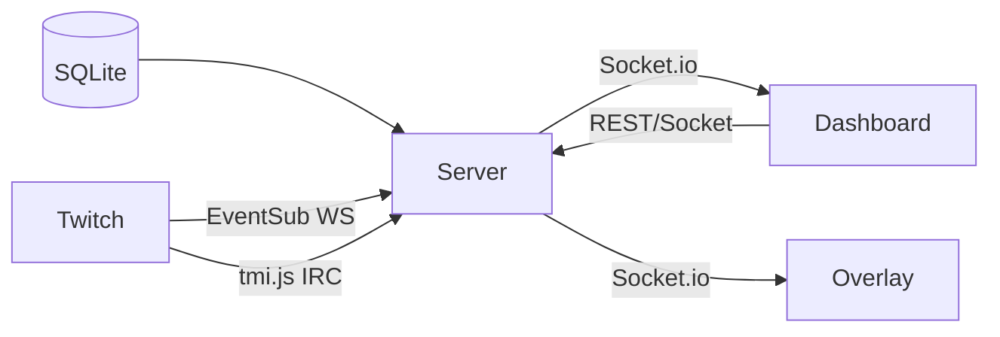

# Architecture Overview

Anomalist is a TypeScript monorepo with three packages: server, dashboard, and overlay.

## Package structure

```
Anomalist/
├── apps/
│   ├── server/          # Node.js + Express + Socket.io backend
│   ├── dashboard/       # SvelteKit admin UI
│   └── overlay/         # SvelteKit browser-source overlay
├── packages/
│   └── types/           # Shared TypeScript types and socket event constants
├── docs/                # VitePress docs (this site)
└── docker-compose.yml
```

## Data flow



The server is the single source of truth. Both the dashboard and overlay connect via Socket.io and receive the full `canvasState` on connection. All mutations go through the server — there is no client-side-only state for canvas content.

## Real-time state

The core shared object is `canvasState`: a flat map of widget IDs to widget objects. When any property changes, the server broadcasts the updated state to all connected clients.

There is no staging/live split — what you see in the dashboard is what viewers see. Widget visibility toggles are the "publish" mechanism.

## Key modules (server)

| File | Responsibility |
|---|---|
| `server.ts` | Express + Socket.io setup, REST routes |
| `canvas.ts` | canvasState mutations, persistence |
| `twitch.ts` | OAuth token management, stream API calls |
| `chatbot.ts` | tmi.js IRC connection, command parsing |
| `eventsub.ts` | Twitch EventSub WebSocket, alert emission |
| `db.ts` | SQLite (better-sqlite3) setup and migrations |
| `permissions.ts` | Permission check middleware |

## Decisions worth knowing

- **No iframes for external content** — streamer safety (banned media risk). Custom HTML uses a sandboxed iframe with user-authored content only.
- **Timer uses wall-clock** — `startedAt` timestamp stored on the widget, not an internal counter. Survives server restarts.
- **EventSub uses `ws` npm package** — not Node's built-in `WebSocket`, which was unreliable in Node 20 at time of writing.
- **Alert flash is overlay-local** — the overlay tracks flashed widgets in a `Set` and never round-trips to the server. Keeps latency low.
- **`@anomalist/types` must be rebuilt** after adding socket event constants, or runtime values are `undefined`.

## Next: [Stack details](/dev/stack) | [Widget SDK](/dev/widget-sdk)
